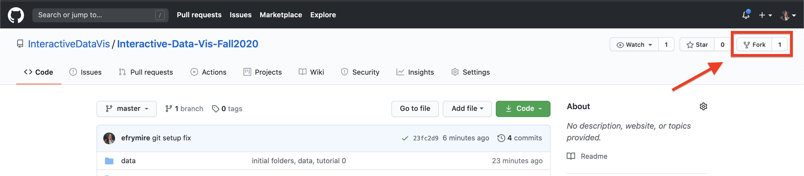
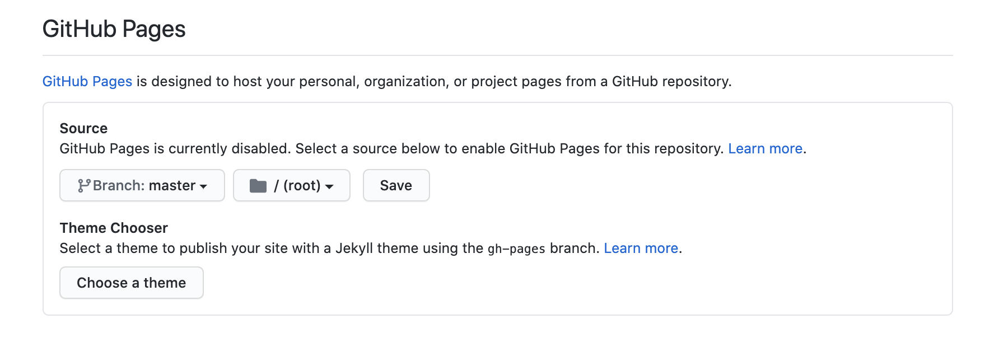

# Github Setup

You can read more about `forking`, `syncing`, and our overall github flow [here](https://help.github.com/en/github/getting-started-with-github/fork-a-repo).

### 1. On Gitub, go to our [Class Repository](https://github.com/InteractiveDataVis/Interactive-Data-Vis-Sp2021.git) and [`fork`](https://docs.github.com/en/github/getting-started-with-github/fork-a-repo) this repository into your own account.

To do this, click on the "fork" button on the top right of this github account.



This creates a clone of our class repository in your own github account. You can see this worked by confirming your github username appears before the repository name:


### 2. Set up your Github Pages for your deployment

To deploy your site on [Github Pages](https://help.github.com/en/github/working-with-github-pages/creating-a-github-pages-site#creating-your-site) you can go to your repository's `Settings` tab and then scroll down to `GitHub Pages` section. Select `main` as source and then your site will be avallable at `https://[YOUR_USERNAME].github.io/[YOUR_REPOSITORY_NAME]/`. *NOTE*: You must navidate in the URL to a folder with an index.html, or else you will get a 404. This will take a few minutes to update with any pushed changes.



### 3. On GitHub, navigate to **your fork** of the repository and clone it to your local computer.

To do this, navigate to the folder where you want to save your files (I like to save mine in `Documents/Repositories`). (Hint: `cd` or 'change directory' will help you get there through terminal).

```sh
# from Terminal:

# navigate to where you want to save your code
$ cd PATH_TO_YOUR/FOLDER

# clone your fork to your local computer
$ git clone https://github.com/[YOUR_USERNAME]/Interactive-Data-Vis-Sp2021

# `cd` (change directory) into this repository
$ cd Interactive-Data-Vis-Sp2021
```

### 4. Set up your local repository so that it links back to the course repository.

We do this so that you can keep your local branch synced up with the main course repository in the event that we update the material. That way, every week when we add changes, you can `pull` in the new changes from our original class repository.

```sh
#See current remote branches:

$ git remote -v
> origin	https://github.com/[YOUR_USERNAME]/Interactive-Data-Vis-Sp2021 (fetch)
> origin	https://github.com/[YOUR_USERNAME]/Interactive-Data-Vis-Sp2021 (push)

# notice currently this is only tracking your version of the repository.
```

Add an `upstream` remote branch so you can keep yours synced with the main class repository:

```sh
$ git remote add upstream https://github.com/InteractiveDataVis/Interactive-Data-Vis-Sp2021.git
```

Check remote branches again to ensure that the update worked. You should see 2 sets of branches, `origin` which links back to your fork, and `upstream` which references back to the course repository:

```sh
$ git remote -v
> origin	https://github.com/[YOUR_USERNAME]/Interactive-Data-Vis-Sp2021 (fetch)
> origin	https://github.com/[YOUR_USERNAME]/Interactive-Data-Vis-Sp2021 (push)
> upstream	https://github.com/InteractiveDataVis/Interactive-Data-Vis-Sp2021.git (fetch)
> upstream	https://github.com/InteractiveDataVis/Interactive-Data-Vis-Sp2021.git (push)

# now notice see that we are tracking both the original and your version of the repository
```

### 6. Keep your repository [synced](https://help.github.com/en/github/getting-started-with-github/fork-a-repo#keep-your-fork-synced).

Make sure to do this before working on new code (before each tutorial) to ensure that you are working off of the latest updates. We may update the course repository at some point in the semester, and this command will update your fork to include the changes we made, including that week's class example or other materials we have added.

```sh
# pulls the upstream changes and stores them in `upstream/main`
$ git fetch upstream
```

```sh
# merges the changes from upstream into your current branch
$ git merge upstream/main
```

(You can read more information about this [here](https://help.github.com/en/github/collaborating-with-issues-and-pull-requests/syncing-a-fork))

### 7. Push up and deploy your changes

[Note: VS Code has some great [tools](https://code.visualstudio.com/docs/editor/versioncontrol#_git-support) built in to help with this process.]

When you have made a change that you want to keep, you can commit your changes:

```sh
# see which files have changes associated with them
git status

# add, or 'stage', files or folders for this commit
git add [path/fileName]

# commit the files with a brief explanation of what you are changing
# ex: `git commit -m 'add bar chart legend`
git commit -m 'message regaring what changes you are commiting'
```

When you are ready to push up your code to your remote repository, you can run:

```sh
$ git push
```

**That's it! Now you are ready to create, update, and deploy your own websites 🎉!**
