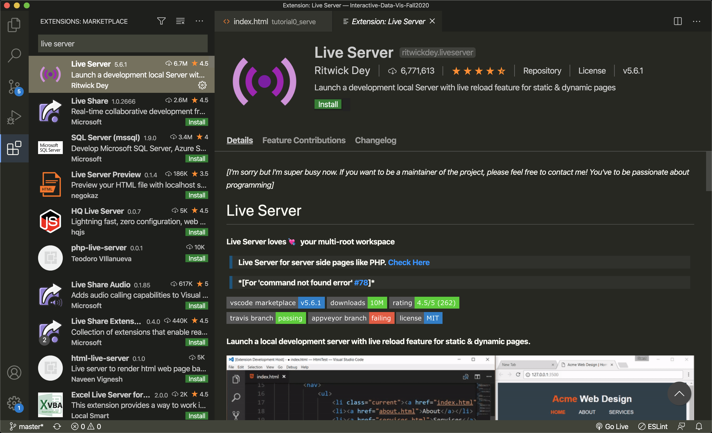
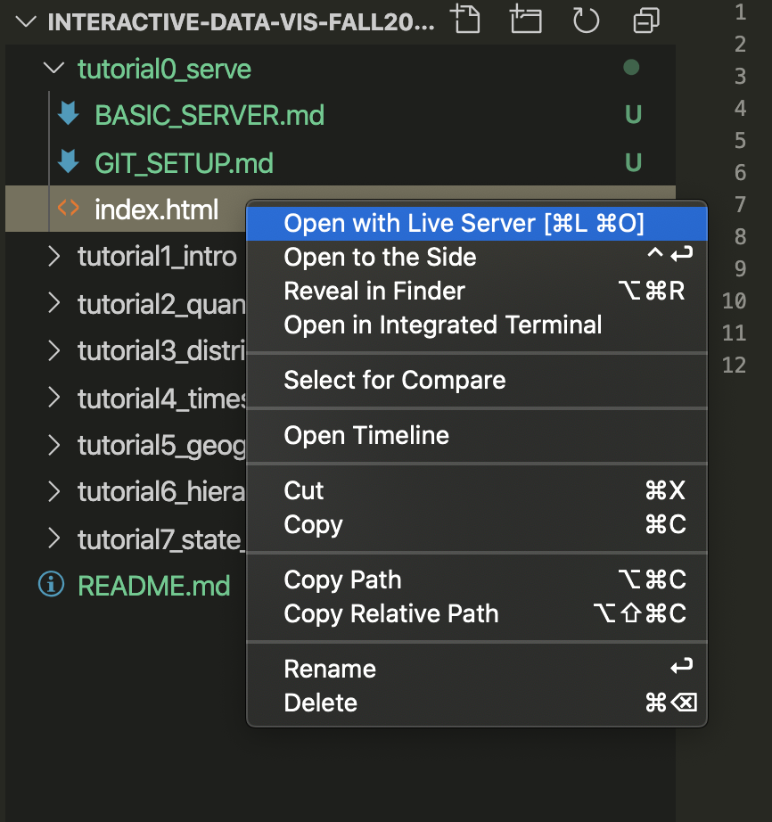

# Local Server

To assist with development, we can serve our files locally to view them as we code. If you are interested about this process, you can read more about servers [here](https://developer.mozilla.org/en-US/docs/Learn/Common_questions/How_does_the_Internet_work), [here](https://developer.mozilla.org/en-US/docs/Learn/Common_questions/What_is_a_web_server), and [here](https://developer.mozilla.org/en-US/docs/Learn/Common_questions/set_up_a_local_testing_server).


## Option 1: VS Code Server

Our first integrated option within our editor is a code extension called [Live Server](https://marketplace.visualstudio.com/items?itemName=ritwickdey.LiveServer). This option allows you to launch a server directly in VS Code.

To install the Live Server extention, open VS Code and navigate to the extensions search tool, either with the tab icon () or with `command` + `shift` + `p`, search "extensions", and select "Extensions: Install Extensions".

In the search bar, search for "Live Serve". Click the green "install" button.



Now the extension is installed. The green "install" button will turn to a grey "uninstall" button.

To start a new serve, right click on the HTML file you intend to serve. You will see a new menu item that says "Open with a Live Server". Select this menu option.



A new browser window will appear as a server for this specific file at the local server url (ex: `http://127.0.0.1:5500/tutorial1_getting_started/index.html`)


## Option 2: Node Server

Our second option to serve our files is through a local server via an npm mpdule.

Before you start, you will need to install [serve](https://github.com/zeit/serve#readme), which is a library for written for running a simple NodeJS server. Luckily, since we already have Node installed, we also have access to `NPM,` or Node Package Manager, which we can use to install serve and all of its dependencies. To do that, running the following from your terminal/commamd line:

```sh
# goes through and installs the library and all of its dependencies
$ npm install -g serve
```

Once your installations are complete and you're ready to begin working on your tutorial assignment, use your terminal (or git bash, on PC) to navigate to the _root directory_ of your fork. Your path may look different, but the command will be something like this:

```sh
$ cd Documents/My\ Repositories/Interactive-Data-Vis-Spring2021/
```

From this level, (_not from the tutorial folder_), run:

```sh
$ serve
```

This will start a [simple web server](https://github.com/zeit/serve#readme) that will serve the course files. After you run this line you should see something like the following:


Your files will now be available if you go to the following address in your browser `http://localhost:5000`.

When you open `http://localhost:5000/`, you should see your repository's folder structure. Click into that week's tutorial. The file showing is your `index.html` file. If you want to view the class demo file, you can change your URL path. For example: `http://localhost:5000/TUTORIAL_PATH/demo`.
